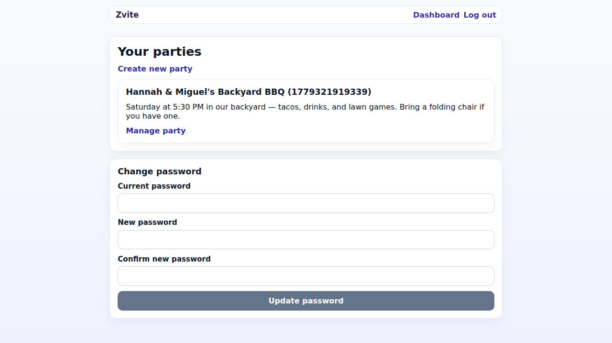
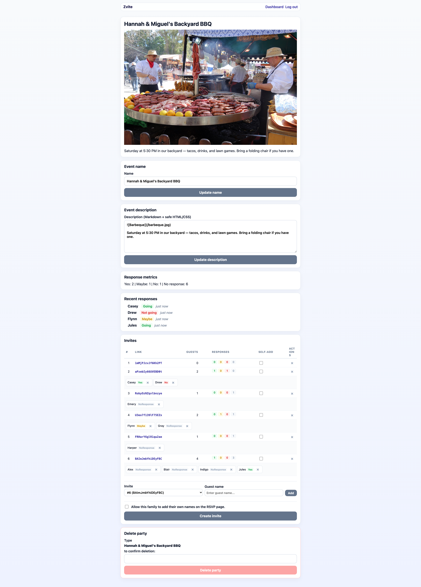
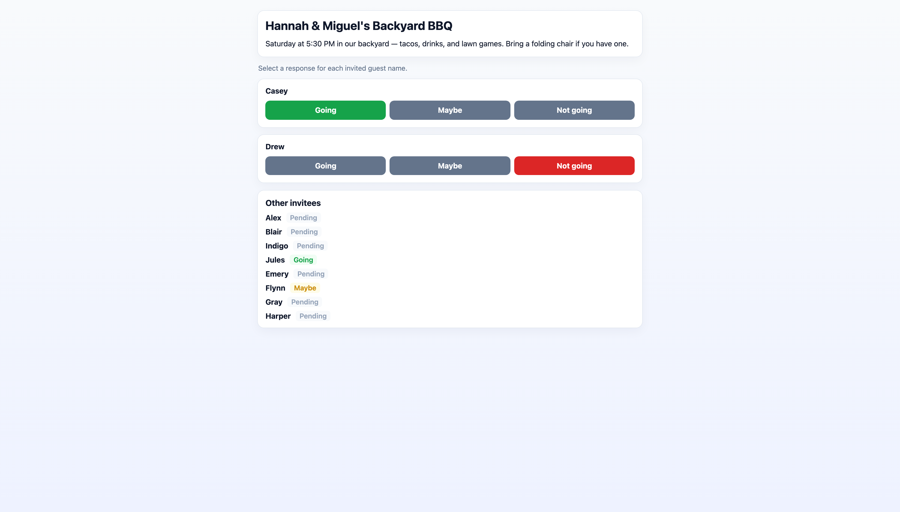

# Zvite

After looking at the existing RSVP apps and websites, I didn't like any of them:

* Evite: filled with ads, tracking, requires guests to sign up for evite
* Partiful: requires guests to sign up for partiful
* Apple Invites: requires guests to enter their names and pick a color for whatever reason
* Luma: requires emails for guests; I want to send the links to my friends myself
* Gathio: too much branding, requires an explicit end time, too many unnecessary features cluttering the RSVP UI

So I made my own that does exactly what I wanted for my party, and doesn't do anything I don't want.







## AI

I consider myself an "agentic engineer". For tasks that are "easier described than done", I use agents to build my software.

Most of the code was written with AI agents.

Many of my other projects are written with no AI to maintain and build on my own skills, but that is not the case with this project. Feel free to use AI for any contributions you would like to post as PRs.

## Features

- **Event management** — create events with a name and Markdown description
- **Magic invite links** — generate unique, shareable tokens for each guest group; no sign-up to RSVP
- **Multi-guest invites** — each invite can have multiple people (e.g. a family of 4 can be one invite with 4 names), and the RSVP tracks each name separately
- **RSVP tracking** — guests respond Yes / Maybe / No per name, with live metrics
- **Self-add names** — optionally allow guests to add their own names from the RSVP page
- **JS Optional** — all features of the site work without JavaScript on the client
- **SQLite via `bun:sqlite`** — simple, no ORM, plain SQL prepared statements

## Tech Stack

| Layer     | Technology                 |
| --------- | -------------------------- |
| Framework | SvelteKit 2 (Svelte 5)     |
| Runtime   | Bun                        |
| Database  | SQLite (`bun:sqlite`)      |
| Styling   | Custom CSS                 |
| Markdown  | `marked` + `sanitize-html` |

## Docker

```sh
docker pull ghcr.io/wingysam/zvite:latest
docker run -d -p 3000:3000 -v zvite-data:/data ghcr.io/wingysam/zvite:latest
```

Persistent data is stored in the `/data` volume (`/data/app.db`).

## Developer Instructions

```sh
bun install
bun dev
```

Open [http://localhost:5173](http://localhost:5173).

## Scripts

| Command                          | Description                                  |
| -------------------------------- | -------------------------------------------- |
| `bun dev`                        | Start the dev server                         |
| `bun run build`                  | Production build                             |
| `bun run preview`                | Preview the production build                 |
| `bun run check`                  | Run Svelte type-checking                     |
| `bun run check:watch`            | Type-check in watch mode                     |
| `bun run e2e`                    | Run the Playwright end-to-end suite          |
| `bun run e2e:update-screenshots` | Run e2e tests and refresh README screenshots |

## Environment Variables

| Variable          | Default   | Description                                                                                             |
| ----------------- | --------- | ------------------------------------------------------------------------------------------------------- |
| `DISABLE_SIGNUPS` | `false`   | Set to `true` to hide the Register link and block sign-ups. The existing login page will show a notice. |
| `DB_PATH`         | `app.db`  | Path to the SQLite database file. In Docker, defaults to `/data/app.db`.                                |
| `PORT`            | `3000`    | Port the server listens on.                                                                             |
| `HOST`            | `0.0.0.0` | Host to bind to.                                                                                        |
